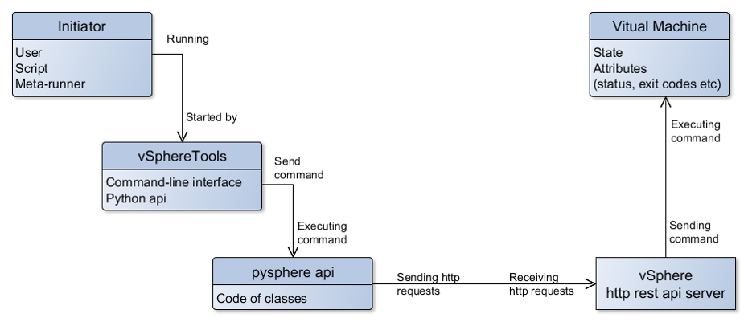

# vspheretools

# How to use vspheretools-metarunners
* Install (or copy) xml metarunners on your TeamCity admin page: https://[teamcity_server]/admin/editProject.html?projectId=_Root&tab=metaRunner (Administration - Root project - Meta-Runners)
* Create new VCS from vspheretools project: https://github.com/devopshq/vspheretools
* Attach new VCS to your TeamCity project and set up checkout rules: 
+:.=>%default_devops_tools_path_local%/vspheretools
* Create variable default_devops_tools_path_local in your TeamCity project and set value, e.g. "devops-tools". It is local path for devops-tools repository.

***Содержание:***
- [Общие сведения](#Chapter_1)
    - [Требования к окружению](#Chapter_1_1)
    - [Установка](#Chapter_1_2)
- [Работа в консоли](#Chapter_2)
    - [Опции](#Chapter_2_1)
    - [Команды](#Chapter_2_2)
    - [Примеры использования](#Chapter_2_3)
- [Работа c vspheretools через метараннеры в TeamCity](#Chapter_3)
    - [Как добавить vspheretools-metarunners](#Chapter_3_1)
- [Работа через API](#Chapter_4)
    - [Глобальные переменные](#Chapter_4_1)
    - [Методы](#Chapter_4_2)
- [Типичные проблемы и способы их устранения](#Chapter_5)

# Общие сведения 
**vSphereTools** - это набор скриптов от DevOpsHQ для поддержки работы с vSphere и виртуальными машинами (ВМ) на ней, в основе которых лежит библиотека pysphere. Эти скрипты были написаны для целей интеграции vSphere с TeamCity на уровне шагов конфигураций, реализованных через мета-раннеры. Также возможно использование инструментов vSphereTools из консоли или импортируя нужные модули и методы в свои проекты. Для работы vSphereTools из консоли используются пайтоновские скрипты VSphereTools.py.

Как работает инструмент? Смотрите на схеме ниже.

## Требования к окружению 

1. Служебный пользователь для доступа к Сфере, чьи логин и пароль вы будете подставлять в скриптах и метараннерах: желательно с ограниченными правами доступа только до вашего каталога с ВМ. Рекомендуется создавать для доменного аккаунта логин и пароль без спецсимволов и пробелов в имени, допускаются только буквы и цифры.
2. С машины, где выполняется запуск скриптов для пользователя, от имени которого исполняются эти скрипты, обязательно должен быть доступен сервис vcenter - Сфера и нужный кластер, а также ESX на котором работает ВМ.
3. На ВМ должны быть установлены инструмент VMvare Tools (контекстное меню ВМ -> Guest -> Install/Upgrade VMvare Tools).
4. На машине, где выполняется запуск скриптов, установлен Python 2*, версий 2.7 или старше. 

## Установка 

1. Необходимо скачать vSphereTools из гит-репозитория https://github.com/devopshq/vspheretools и распаковать в любой каталог.
2. Либо вы можете установить инструмент через pip:

    pip install vspheretools

# Работа в консоли 

Использование (если вы не устанавливали инструмент через pip, а просто скачали и распаковали):

    python VSphereTools.py [options] [command]

Либо, если инструмент установлен через pip, то просто наберите в консоли:

    vspheretools [options] [command]

Допускается указание множества опций и одна команда, которую нужно выполнить на Сфере.

В примерах далее будем считать, что vspheretools установлен через pip и опускать ключевое слово python.

## Опции 

    -s SERVER_NAME, --server SERVER_NAME - Указать кластер на сервере vSphere. Например, vcenter-01.example.com.
    
    -l USERLOGIN, --login USERLOGIN - Указать логин юзера, у которого есть права на работу с проектом на Сфере. Значение по умолчанию не определено.
    
    -p USERPASSWORD, --password USERPASSWORD - Указать пароль пользователя. Значение по умолчанию не определено.
    
    -n VM_NAME, --name VM_NAME - Указать имя ВМ с которой будут производиться действия. Значение по умолчанию не определено.
    
    -gl GUESTLOGIN, --guest-login GUESTLOGIN - Указать логин юзера для ОС, установленной на ВМ. Значение по умолчанию не определено.
    
    -gp GUESTPASSWORD, --password GUESTPASSWORD - Указать пароль юзера для ОС, установленной на ВМ. Значение по умолчанию не определено.
    
    -d CLONE_DIRECTORY, --clone-dir CLONE_DIRECTORY - Указать имя директории на Сфере, в которую юзер, из под которого выполняется работа, имеет право записи. По умолчанию установлено значение директории Clones - она должна быть создана в проекте на Сфере.
    
    -t TIMEOUT_SEC, --timeout TIMEOUT_SEC - Указать таймаут в секундах для некоторых операций, например, ожидание ip-адреса машины. По умолчанию установлено значение таймаута 300 с.

## Команды 

    --status - Получить статус ВМ, заданной по имени ключом --name. Доступные статусы: 'POWERING ON', 'POWERING OFF', 'SUSPENDING', 'RESETTING', 'BLOCKED ON MSG', 'REVERTING TO SNAPSHOT', 'UNKNOWN'.
    
    --start - Запустить ВМ, заданную по имени ключом --name.
    
    --start-wait - Запустить ВМ, заданную по имени ключом --name, и дождаться полной загрузки OS. Таймаут задаётся опцией --timeout.
    
    --stop - Остановить ВМ, заданную по имени ключом --name.
    
    --snapshots - Отобразить список снапшотов для ВМ, заданной по имени ключом --name.
    
    --create-snapshot SNAPSHOT_NAME - Создать именованный снапшот для ВМ.
    
    --revert-to-current-snapshot - Откатить ВМ, заданную по имени ключом --name, на текущий (активный) снапшот.
    
    --revert-to-snapshot SNAPSHOT_NAME - Откатить ВМ, заданную по имени ключом --name, на снапшот, указанный по имени.
    
    --properties - Отобразить список доступных свойств ВМ, заданной по имени ключом --name.
    
    --get-ip - Отобразить ip-адрес ВМ, заданной по имени ключом --name, если он у неё имеется.
    
    --set-ip-into-teamcity-param TEAMCITY_PARAMETER - Установить параметру в TeamCity с именем TEAMCITY_PARAMETER значение строки с ip-адресом ВМ, заданной по имени ключом --name. По умолчанию, TEAMCITY_PARAMETER = vm_ip.
    
    --clone CLONE_NAME - Клонировать ВМ, заданную по имени ключом --name, в директорию, определенную ключом --clone-dir. К имени машины добавляется префикс "clone-<уникальное_число>-", если указано имя None (по умолчанию) для параметра CLONE_NAME. У пользователя под которым выполняются действия должны быть права на чтение/запись в этот каталог на Сфере.
    
    --delete - Удаляет ВМ, заданную по имени ключом --name. Перед удалением проверяется, что ВМ выключена, и если нет, то выполняется попытка её остановки, затем удаление. ВНИМАНИЕ! Будьте осторожны с этой опцией! Пользователь, из под которого выполняется удаление должен иметь крайне ограниченные права на чтение / запись / удаление только из определённых каталогов проектов на Сфере! 
    
    --upload-file SCR DST REWRITE - Копирует локальный файл на ВМ. Пути обоих файлов должны быть указаны полными. REWRITE=True указывается для перезаписи существующего файла.
    
    --download-file SCR DST REWRITE - Копирует файл из ВМ на указанный локальный путь. Пути обоих файлов должны быть полными. REWRITE=True указывается для перезаписи существующего файла.
    
    --mkdir DIR_PATH CREATESUBS - Создает на ВМ указанную директорию. Если CREATESUBS=True, то создаются все промежуточные поддиректории.
    
    --execute PROGRAM ARGS ENV CWD PYTHONBIN WAIT - Запускает на ВМ указанную программу PROGRAM и возвращает её PID после запуска. ARGS - список дополнительных параметров или ключей запуска программы, разделённые запятыми. ENV - переменные окружения вида ИМЯ:ЗНАЧЕНИЕ, разделенные запятыми. CWD - рабочая директория программы. PYTHONBIN - полный путь до бинаря python 2.* на ВМ. WAIT - ожидать или нет окончания работы программы и пробрасывать код выхода и логи процесса.

## Примеры использования 

Если во входных параметрах используются пробелы, то задавайте их значения в двойных кавычках: "имя ВМ с пробелом"

Получить текущий статус ВМ:

    vspheretools --server vcenter-01.example.com --login <Domain_account> --password <userpass> --name <full_VM_name> --status

Запустить ВМ:

    vspheretools --server vcenter-01.example.com --login <Domain_account> --password <userpass> --name <full_VM_name> --start

Запустить ВМ и дожидаться загрузки OS в течение 5 минут:

    vspheretools --server vcenter-01.example.com --login <Domain_account> --password <userpass> --name <full_VM_name> --timeout 300 --start-wait

Остановить ВМ:

    vspheretools --server vcenter-01.example.com --login <Domain_account> --password <userpass> --name <full_VM_name> --stop
 
Получить список снапшотов:

    vspheretools --server vcenter-01.example.com --login <Domain_account> --password <userpass> --name <full_VM_name> --snapshots

Создать снапшот:

    vspheretools --server vcenter-01.example.com --login <Domain_account> --password <userpass> --name <full_VM_name> --create-snapshot name="Snapshot name" rewrite=True fail-if-exist=False

Откатить ВМ на текущий (активный) снапшот:

    vspheretools --server vcenter-01.example.com --login <Domain_account> --password <userpass> --name <full_VM_name> --revert-to-current-snapshot
 
Откатить ВМ на снапшот по его имени:

    vspheretools --server vcenter-01.example.com --login <Domain_account> --password <userpass> --name <full_VM_name> --revert-to-snapshot <full_snapshot_name>

Получить список свойств ВМ:

    vspheretools --server vcenter-01.example.com --login <Domain_account> --password <userpass> --name <full_VM_name> --properties

Получить текущий ip-адрес ВМ с таймаутом данной операции в 10 секунд:

    vspheretools --server vcenter-01.example.com --login <Domain_account> --password <userpass> --name <full_VM_name> --timeout 10 --get-ip
 
Установить в TeamCity значение параметра vm_ip равное текущему ip-адресу ВМ, с таймаутом данной операции в 10 секунд:

    vspheretools --server vcenter-01.example.com --login <Domain_account> --password <userpass> --name <full_VM_name> --timeout 10 --set-ip-into-teamcity-param vm_ip
  
Сделать новый клон ВМ в указанную директорию:

    vspheretools --server vcenter-01.example.com --login <Domain_account> --password <userpass> --name <full_VM_name> --clone-dir Clones --clone new_clone_name
 
Удалить ВМ. ВНИМАНИЕ! Крайне осторожно используйте эту опцию! У пользователя должны быть ограниченные права на удаление только из конкретных каталогов на Сфере!

    vspheretools --server vcenter-01.example.com --login <Domain_account> --password <userpass> --name <full_VM_name> --delete
 
Скопировать локальный файл на ВМ с его перезаписью:

    vspheretools --server vcenter-01.example.com --login <Domain_account> --password <userpass> --name <full_VM_name> -gl <guest-login> -gp <guest-password> --upload-file <source_file> <destination_file> True

Скопировать файл из ВМ и положить по локальному пути без перезаписи (по умолчанию):

    vspheretools --server vcenter-01.example.com --login <Domain_account> --password <userpass> --name <full_VM_name> -gl <guest-login> -gp <guest-password> --download-file <source_file> <destination_file>
 
Создать директорию и все промежуточные поддиректории (по умолчанию):

    vspheretools --server vcenter-01.example.com --login <Domain_account> --password <userpass> --name <full_VM_name> -gl <guest-login> -gp <guest-password> --mkdir <dir_path>
 
Запустить консоль Windows с параметрами:

    vspheretools --server vcenter-01.example.com --login <Domain_account> --password <userpass> --name <full_VM_name> -gl <guest-login> -gp <guest-password> --execute program="C:\Windows\System32\cmd.exe" args="/T:Green /C echo %aaa% & echo %bbb%" env="aaa:10, bbb:20" cwd="C:\Windows\System32" pythonbin="c:\python27\python.exe" wait=True

# Работа c vspheretools через метараннеры в TeamCity 

Для работы со Сферой в TemCity можно добавить следующие метараннеры:

* DevOps-runner: vspheretools - Show VM status - отображает в логе информацию о статусе ВМ.
* DevOps-runner: vspheretools - Start VM - запускает указанную ВМ.
* DevOps-runner: vspheretools - Start VM and waiting until guest OS started - запускает указанную ВМ и ожидает загрузки OS в течение указанного времени.
* DevOps-runner: vspheretools - Stop VM - останавливает указанную ВМ.
* DevOps-runner: vspheretools - Show VM snapshots - выводит список доступных снапшотов для ВМ.
* DevOps-runner: vspheretools - Create VM snapshot - создаёт снапшот для ВМ.
* DevOps-runner: vspheretools - Revert VM to current snapshot - откатывает ВМ на текущий (активный) снапшот.
* DevOps-runner: vspheretools - Revert VM to named snapshot - откатывает ВМ на указанный снапшот. Нужно задать полное имя снапшота. 
* DevOps-runner: vspheretools - Show VM properties - выводит список свойств ВМ.
* DevOps-runner: vspheretools - Show VM ip-address - получает и выводит текущий ip-адрес ВМ, если он есть.
* DevOps-runner: vspheretools - Set VM ip-address into TC parameter - получает текущий ip-адрес ВМ, если он есть, и затем устанавливает его значение в указанную переменную для конфигурации TeamCity. Переменная должна существовать в конфигурации.
* DevOps-runner: vspheretools - Clone VM into directory - клонирует ВМ в указанный каталог на Сфере, куда должен быть доступ на запись для пользователя Сферы.
* DevOps-runner: vspheretools - Delete VM - удаляет ВМ со Сферы. ВНИМАНИЕ! Крайне осторожно используйте этот метараннер! У пользователя должны быть ограниченные права на удаление и только из конкретных каталогов на Сфере! Добейтесь это через отдел IT.
* DevOps-runner: vspheretools - Upload file to VM - копирует локальный файл на указанную ВМ на Сфере, по указанному пути.
* DevOps-runner: vspheretools - Download file from VM - копирует файл из ВМ на Сфере, по указанному локальному пути.
* DevOps-runner: vspheretools - Create directory on VM - создает директорию по указанному пути на ВМ и все промежуточные поддиректории.
* DevOps-runner: vspheretools - Execute command on VM - запускает указанную программу на ВМ с возможностью ожидания её окончания и получения консольных логов и exit-кода.

## Как добавить vspheretools-metarunners 
* Загрузите xml-метараннеры в вашей админке TeamCity: https://[teamcity_server]/admin/editProject.html?projectId=_Root&tab=metaRunner (Administration - Root project - Meta-Runners)
* Создайте новую VCS в вашем проекте и добавьте в неё vspheretools: https://github.com/devopshq/vspheretools
* Добавьте VCS к вашему TeamCity-проекту и настройте checkout rules:
+:.=>%default_devops_tools_path_local%/vspheretools
* Создайте переменную default_devops_tools_path_local в вашем TeamCity-проекте и установите значение по умолчанию "devops-tools". Оно используется внутри метараннеров в виде %default_devops_tools_path_local%/vspheretools и указывает на каталог, внутри которого находится подкаталог с выкачанным через VCS репозиторием vspheretools.

# Работа через API 

Нужно импортировать модуль VSphereTools.py. При использовании модуля нужно определить основные константы:

## Глобальные переменные 

    VC_SERVER = r""  # имя кластера сервера Сферы, например, vcenter-01.example.com
    
    VC_LOGIN = r""  # логин учётки, у которой есть доступ к проектам на Сфере на чтение 
    
    VC_PASSWORD = r""  # пароль учётки
    
    VM_NAME = r""  # полное имя виртуальной машины, видимое пользователю, с которой предполагается работать
    
    VM_GUEST_LOGIN = r""  # логин для ОС, установленной на ВМ
    
    VM_GUEST_PASSWORD = r""  # пароль для ОС, установленной на ВМ
    
    VM_CLONES_DIR = "Clones"  # поддиректория для клонированных vm внутри проекта на Сфере, к которой должен быть доступ на чтение и запись для аккаунта, из под которого идёт работа со Сферой
    
    OP_TIMEOUT = 300  # таймауты операций

Для работы со сферой нужно инициализировать любую переменную класса Sphere(), который инициализирует подключение к Сфере, нужному кластеру и виртуальной машине, и содержит основные методы.

## Методы 

    VMStatus() - возвращает строку текущего состояния ВМ заданной по имени VM_NAME
    
    VMStart() - стартует ВМ (VM_NAME) имеющую статус POWERED OFF
    
    VMStartWait() - стартует ВМ (VM_NAME) имеющую статус POWERED OFF и дожидается полной загрузки OS на ней, в течение времени указанного в OP_TIMEOUT
    
    VMStop() - останавливает ВМ (VM_NAME) имеющую статус POWERED ON
    
    GetVMProperties() - возвращает словарь, содержащий все доступные свойства ВМ (VM_NAME)
    
    GetVMSnapshotsList() - возвращает лист инстансов снапшотов ВМ (VM_NAME), которые затем можно, например, использовать для поиска и отката на нужный снапшот по его имени.
    
    CreateVMSnapshot() - создаёт именованный снапшот для ВМ (VM_NAME).
    
    GetVMIPaddress() - возвращает строку с ip-адресом ВМ (VM_NAME), если он у неё есть. Попытки определить ip-адрес выполняются в течении количества секунд, заданных параметром OP_TIMEOUT
    
    SetVMIPaddressIntoTeamCityParameter(paramName) - устанавливает в качестве значения параметра TeamCity, указанного через входную переменную paramName, строку с ip-адресом ВМ (VM_NAME), если он имеется, иначе переменная не изменяется
    
    VMRevertToCurrentSnapshot() - выполняет откат ВМ (VM_NAME) на текущий снапшот
    
    VMRevertToSnapshot(snapshotName) - выполняет откат ВМ (VM_NAME) на указанный снапшот, заданный своим именем через входную переменную snapshotName
    
    CloneVM(cloneName) - клонирует ВМ (VM_NAME) в директорию VM_CLONES_DIR
    
    DeleteVM() - удаляет ВМ (VM_NAME). Перед этим, если требуется, выполняется выключение ВМ.
    
    CopyFileIntoVM(srcFile, dstFile, overwrite) - копирует локальный файл по полному пути srcFile с агента, где выполняется скрипт, на ВМ по полному пути dstFile. overwrite=True для перезаписи файла, если он существует на ВМ.
    
    CopyFileFromVM(srcFile, dstFile, overwrite) - копирует файл по полному пути srcFile с указанной ВМ, на локальный путь dstFile. overwrite=True для перезаписи файла, если он существует локально.
    
    MakeDirectoryOnVM(dirPath, createSubDirs) - создает директорию по указанному пути dirPath и все промежуточные поддиректории, если указано createSubDirs=True.
    
    ExecuteProgramOnVM(\*\*kwargs) - запускает программу с указанными параметрами. Аргументы могут быть следующими: program - путь к программе, например, r"C:\Windows\System32\cmd.exe"; args - аргументы, передаваемые в программу, например, r"/T:Green /C echo %aaa% & echo %bbb%"; env - переменные окружения, например, r"aaa:10, bbb:20"; cwd - путь к рабочей директории программы, например, r"C:\Windows\System32\"; python - полный путь до бинаря python 2.* на ВМ, например, "c:\python27\python.exe"; wait - True, False - ожидать или нет завершения процесса и получать его exit-код.

# Типичные проблемы и способы их устранения 

**1. Если вы видите в логах ошибки вида:**

    VSphereTools.py       [Line:89] ERROR     [2015-08-28 16:48:44,490] Can not connect to vSphere! server = vcenter-01.example.com,
    VIApiException: [InvalidLoginFault]: Cannot complete login due to an incorrect user name or password,
    pysphere.resources.vi_exception.VIApiException: [GuestOperationsUnavailableFault]: The guest operations agent could not be contacted.

и прочие, связанные с авторизацией, то проверьте, что вы правильно указываете логин и пароль: доменный логин должен иметь вид: domain\login, например, .\administartor - учетка локального админа, пароль и логин не должны содержать спецсимволов или экранироваться кавычками.

**2. ValueError**

Если вы видите в логах ошибку похожую на:

    exitCode = sphere.ExecuteProgramOnVM(**dict(kw.split('=') for kw in args.execute))
    ValueError: dictionary update sequence element #3 has length 4; 2 is required

то проверьте правильность заполнения поля "Command-line arguments". Запятыми разделяются только отдельные переменные! Длинные строковые значения одной переменной разделять запятой не надо.
